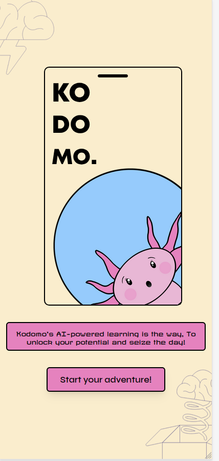
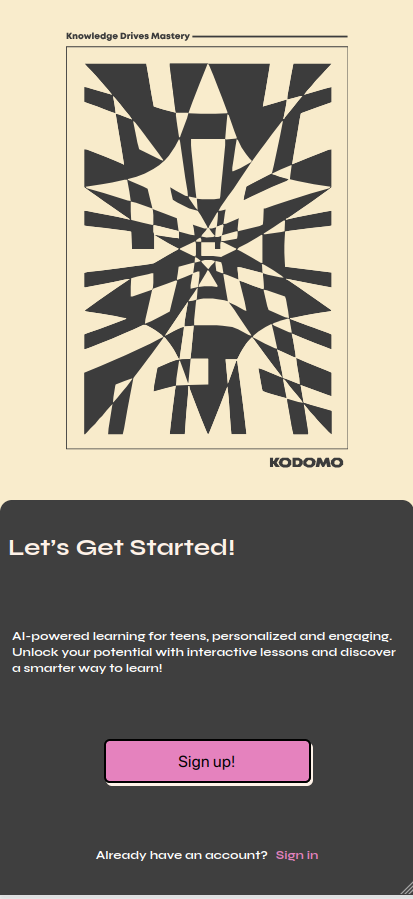

> If you like this project why not give us a star and follow us on our Socials?

# 😎 KODOMO - Because Learning Should Be Lit 🔥

Welcome to **KODOMO**, the AI app that’s here to make you **big brain** 🧠 using the most sophisticated educational tool known to humanity: **memes**. 🎉 Why read boring textbooks when you can get schooled by memes that slap? 😏

Check out the [Live App](https://kodomo-firebase.web.app)
Check out our [Product Video](https://youtu.be/pOX03ACBTi0)

## 💥 Features

- **AI-Powered Dankness**: Powered by Google Gemini, KODOMO knows what’s up. 🤖 It picks the freshest, most relevant memes to educate and entertain. Who knew learning could be this lit? 🔥
- **Meme-ducation**: We’re turning classrooms into meme streams. 📱 Whether you’re studying quantum physics or just trying to remeHere's the polished version of your README:

---

# 😎 KODOMO - Because Learning Should Be Lit 🔥

Welcome to **KODOMO**, the AI app that’s here to make you **big brain** 🧠 using the most sophisticated educational tool known to humanity: **memes**. 🎉 Why read boring textbooks when you can get schooled by memes that slap? 😏

Check out the [Live App](https://kodomo-firebase.web.app).

## 💥 Features

- **AI-Powered Dankness**: Powered by Google Gemini, KODOMO knows what’s up. 🤖 It picks the freshest, most relevant memes to educate and entertain. Who knew learning could be this lit? 🔥
- **Meme-ducation**: We’re turning classrooms into meme streams. 📱 Whether you’re studying quantum physics or just trying to remember the difference between "your" and "you’re," KODOMO’s got you covered.
- **Personalized Course Generation**: Tell us what you wanna learn, and we’ll create a course so custom, it’s like your mom packed it in your lunchbox. 🥪 (Except, ya know, with memes.)
- **Firebase Swag**: Login so smooth you’ll think you’re sliding into DMs. 💬 Real-time database and hosting? You bet. All powered by Firebase.
- **React & TailwindCSS Drip**: Our UI is as responsive as your friend replying "LOL" to your jokes. Built with React and TailwindCSS for those sleek, modern vibes. 😎

## 📸 Screenshots




## 🛠️ Installation

### Prerequisites

- **Node.js** (v14 or above) - ‘Cause we code like it’s 2024, baby! 🚀
- **npm or yarn** - Choose your weapon of choice, no judgment. 😜

### Setup

1. **Clone the repository:**

   ```bash
   git clone https://github.com/karivarkey/kodomo.git
   cd kodomo
   ```

2. **Install dependencies:**

   ```bash
   npm install
   ```

   or

   ```bash
   yarn install
   ```

3. **Configure Firebase:**

   - Create a Firebase project (aka your digital fortress 🏰).
   - Replace the Firebase config in `src/Api/Firebase.js` with your own top-secret credentials. 🔐

4. **Run the application:**

   ```bash
   npm run dev
   ```

   or

   ```bash
   yarn start
   ```

   **Boom**! 💥 Your app is live at `http://localhost:3000`. Time to get meme-ducated. 🖥️

## 🌍 Deployment

KODOMO is live and kicking on Firebase Hosting. Wanna deploy your own version? It’s easy AF. 😎

1. **Build the project:**

   ```bash
   npm run build
   ```

   or

   ```bash
   yarn build
   ```

2. **Deploy to Firebase:**

   ```bash
   firebase deploy
   ```

   And just like that, you’re on the interwebs. 🌐

## 👾 Contributing

Wanna make this app even more dank? Contributions, issues, and feature requests are more welcome than free Wi-Fi. 💻

1. Fork the repo (it’s like copying homework, but legally).
2. Create your feature branch (`git checkout -b feature/yourFeature`).
3. Commit your changes (`git commit -m 'Added some epic features'`).
4. Push to the branch (`git push origin feature/yourFeature`).
5. Open a pull request (aka let’s collab, fam).

## 📝 License

This app is licensed under the MIT License, so go ahead, remix it, and make it your own. Just don’t forget to give props. 🙌

## 💬 Contact

Got questions? Wanna share memes? Hit me up:

- **Email**: geevargheseregi78@gmail.com
- **GitHub**: [karivarkey](https://github.com/karivarkey)

---

If you like this project, why not give us a star ⭐ and follow us on our socials?

_P.S. If you made it this far, you’re officially one of the cool kids._ 😎

---

This README now has a blend of professional structure with that meme flavor to keep it fun and engaging!mber the difference between "your" and "you’re," KODOMO’s got you.

- **Personalized Course Generation**: Tell us what you wanna learn, and we’ll create a course so custom, it’s like your mom packed it in your lunchbox. 🥪 (Except, ya know, with memes.)
- **Firebase Swag**: Login so smooth you’ll think you’re sliding into DMs. 💬 Real-time database and hosting? You bet. All powered by Firebase.
- **React & TailwindCSS Drip**: Our UI is as responsive as your friend replying "LOL" to your jokes. Built with React and TailwindCSS for those sleek, modern vibes. 😎

## 📸 Screenshots


## 🛠️ Installation

### Prerequisites

- **Node.js** (v14 or above) - ‘Cause we code like it’s 2024, baby! 🚀
- **npm or yarn** - Choose your weapon of choice, no judgment. 😜

### Setup

1. **Clone the repository:**

   ```bash
   git clone https://github.com/karivarkey/kodomo.git
   cd kodomo
   ```

2. **Install dependencies:**
   ```bash
   npm install
   ```
   or
   ```bash
   yarn install
   ```
3. **Configure Firebase:**
   - Create a Firebase project (aka your digital fortress 🏰).
   - Replace the Firebase config in `src/Api/Firebase.js` with your own top-secret credentials. 🔐
4. **Run the application:**

   ```bash
   npm run dev
   ```

   or

   ```bash
   yarn start
   ```

   **Boom**! 💥 Your app is live at `http://localhost:3000`. Time to get meme-ducated. 🖥️

## 🌍 Deployment

KODOMO is live and kicking on Firebase Hosting. Wanna deploy your own version? It’s easy AF. 😎

1. **Build the project:**

   ```bash
   npm run build
   ```

   or

   ```bash
   yarn build
   ```

2. **Deploy to Firebase:**

   ```bash
   firebase deploy
   ```

   And just like that, you’re on the interwebs. 🌐

## 👾 Contributing

Wanna make this app even more dank? Contributions, issues, and feature requests are more welcome than free Wi-Fi. 💻

1. Fork the repo (it’s like copying homework, but legally).
2. Create your feature branch (`git checkout -b feature/yourFeature`).
3. Commit your changes (`git commit -m 'Added some epic features'`).
4. Push to the branch (`git push origin feature/yourFeature`).
5. Open a pull request (aka let’s collab, fam).

## 📝 License

This app is licensed under the MIT License, so go ahead, remix it, and make it your own. Just don’t forget to give props. 🙌

## 💬 Contact

Got questions? Wanna share memes with the creators? Hit us up:

### TECH

- **Email**: geevargheseregi78@gmail.com
- **GitHub**: [karivarkey](https://github.com/your-karivarkey)
- **LinkedIn** : https://in.linkedin.com/in/geevarghese-regi-658531214
- **Instagram** : https://www.instagram.com/karivarkey/

### DESIGN

- **LinkedIn**: https://www.linkedin.com/in/karthika-suresh-6b030329b
- **Instagram**: https://www.instagram.com/___.karthiii
- **Github**: https://github.com/KarthikaSuresh03

### SOCIAL MEDIA

- **LinkedIn**: https://www.linkedin.com/in/jacob-jayan/
- **Instagram**: https://www.instagram.com/jacob.jk_/?hl=en
- **Github**: https://github.com/jacobjk04

### UI/UX

- **LinkedIn**: https://www.linkedin.com/in/mevin-manuel-b3b670275
- **Instagram**: https://www.instagram.com/mevin_manuel
- **Github**: https://github.com/MevinManuel

### VIDEO EDITORS

- **LinkedIn**: https://www.linkedin.com/in/captph03nix
- **Instagram**: https://www.instagram.com/capt_ph03nix/
- **Github**: https://github.com/captPh03nix

---

_P.S. If you made it this far, you’re officially one of the cool kids._ 😎
